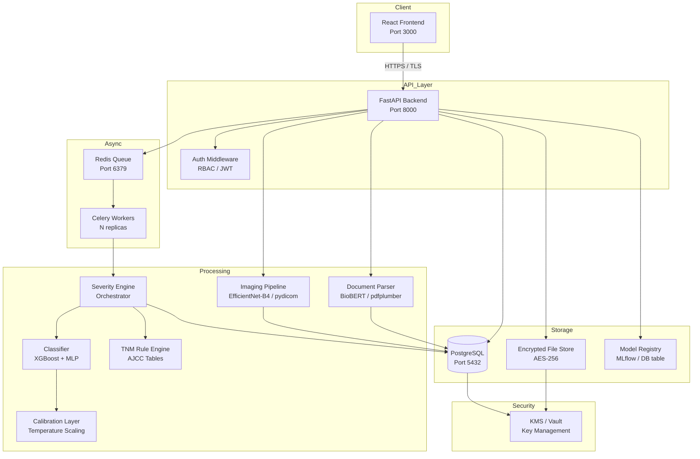
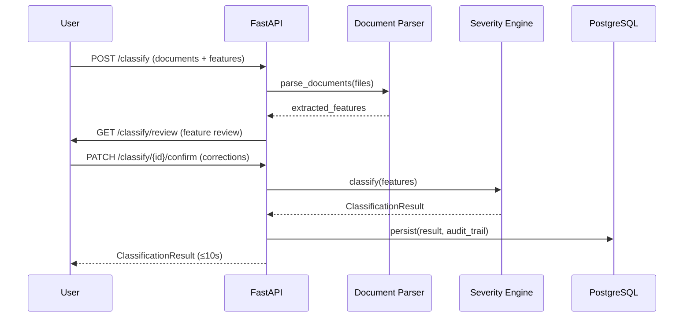
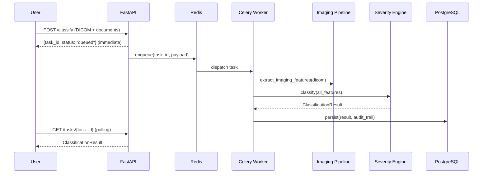

# Design Document: Breast Tumor Severity Classifier

## Overview

The Breast Tumor Severity Classifier is a clinical decision-support platform that accepts patient medical documents and structured clinical data, extracts oncology-validated features, and produces a grounded severity classification. The classification follows a strict two-step pipeline: a calibrated ML ensemble (XGBoost + neural network) determines benign vs. malignant, then a deterministic TNM_Rule_Engine assigns AJCC staging (I–IV) for malignant cases only.

The system is designed around three core principles:
1. **Grounded output** — every output value is traceable to a specific input source; no implicit inference.
2. **Clinical accuracy** — the Classifier must meet AUC ≥ 0.97, sensitivity ≥ 0.95, specificity ≥ 0.90.
3. **Auditability** — every classification decision is logged with full feature provenance.

---

## Architecture

### High-Level System Architecture



### Request Flow — Synchronous (≤10 MB, no CNN)



### Request Flow — Asynchronous (>10 MB or CNN required)



---

## Components and Interfaces

### 1. React Frontend

Responsibilities: document upload UI, feature review/correction form, result display, PDF export, admin dashboard.

Key pages:
- `/upload` — multi-file upload with drag-and-drop, format/size validation feedback
- `/review/{session_id}` — extracted feature table with inline editing
- `/results/{session_id}` — Severity_Label, Confidence_Score, feature importance, audit trail
- `/admin/registry` — model versions, metrics, override rate dashboard

### 2. FastAPI Backend

Responsibilities: request routing, auth enforcement, orchestration of Document_Parser and Severity_Engine, async task dispatch, result retrieval.

Key routers:
- `POST /api/v1/upload` — file ingestion, format/size validation, returns `document_id[]`
- `POST /api/v1/classify` — creates classification session, dispatches sync or async
- `GET /api/v1/classify/{session_id}/review` — returns extracted features for user review
- `PATCH /api/v1/classify/{session_id}/confirm` — accepts user corrections, triggers classification
- `GET /api/v1/tasks/{task_id}` — async task status and result polling
- `POST /api/v1/classify/{session_id}/override` — logs clinician override
- `GET /api/v1/admin/registry` — model registry (admin only)
- `GET /api/v1/admin/overrides` — override log and rolling rate (admin only)
- `DELETE /api/v1/sessions/{session_id}` — permanent data deletion

### 3. Document Parser (BioBERT / NLP)

Responsibilities: extract structured Clinical_Features from PDF, JPEG, PNG, TIFF documents.

```python
class DocumentParser:
    def parse(self, file_bytes: bytes, mime_type: str) -> ParsedDocument: ...
    def extract_features(self, parsed: ParsedDocument) -> RawFeatureMap: ...
```

- PDF: `pdfplumber` for text extraction → BioBERT NER for entity recognition
- Images (JPEG/PNG/TIFF): `pytesseract` OCR → BioBERT NER
- Named entities mapped to Clinical_Features schema via `FeatureExtractor`

### 4. Imaging Pipeline (EfficientNet-B4)

Responsibilities: DICOM ingestion, tumor segmentation, imaging feature extraction.

```python
class ImagingPipeline:
    def load_dicom(self, file_bytes: bytes) -> np.ndarray: ...
    def segment_tumor(self, image: np.ndarray) -> SegmentationMask: ...
    def extract_features(self, image: np.ndarray, mask: SegmentationMask) -> ImagingFeatures: ...
```

- `pydicom` for DICOM parsing and pixel array extraction
- EfficientNet-B4 fine-tuned on CBIS-DDSM for segmentation
- Post-segmentation morphological analysis: shape regularity (circularity index), margin classification (5-class), density estimation (BI-RADS scale)
- Features with model confidence < 0.85 are marked `missing`

### 5. Severity Engine

Responsibilities: orchestrate two-step classification, apply confidence penalties, enforce grounded output.

```python
class SeverityEngine:
    def classify(self, features: ClinicalFeatures) -> ClassificationResult: ...
    def _apply_missing_penalties(self, base_score: float, features: ClinicalFeatures) -> float: ...
    def _invoke_tnm(self, features: ClinicalFeatures) -> TNMStage: ...
```

### 6. Classifier (XGBoost + MLP Ensemble)

Responsibilities: benign/malignant discrimination from structured Clinical_Features.

Architecture:
- **XGBoost** model trained on tabular clinical features (TCGA-BRCA + CBIS-DDSM derived)
- **MLP** (3-layer, 256-128-64 units, ReLU, dropout 0.3) trained on same feature set
- Ensemble: weighted average of calibrated probabilities (XGBoost weight 0.6, MLP weight 0.4)
- **Calibration_Layer**: temperature scaling applied post-training

```python
class Classifier:
    def predict_proba(self, features: ClinicalFeatures) -> tuple[float, float]: ...  # (p_benign, p_malignant)
    def predict(self, features: ClinicalFeatures) -> tuple[str, float]: ...  # (label, calibrated_score)
```

### 7. Calibration Layer (Temperature Scaling)

Temperature scaling divides the logit by a learned scalar `T` before softmax:

```
p_calibrated = softmax(logit / T)
```

`T` is fit on a held-out calibration set by minimizing NLL. Reliability curves (expected calibration error) are generated during validation to verify calibration quality.

```python
class TemperatureScaler:
    def __init__(self, temperature: float): ...
    def calibrate(self, logits: np.ndarray) -> np.ndarray: ...
    def fit(self, logits: np.ndarray, labels: np.ndarray) -> float: ...  # returns optimal T
```

### 8. TNM Rule Engine

Deterministic AJCC 8th edition staging table lookup. Only invoked for malignant cases.

```python
class TNMRuleEngine:
    def stage(self, t: TValue, n: NValue, m: MValue) -> AJCCStage: ...
    # Returns: Stage I, II, III, or IV per AJCC 8th edition table
```

T values: T1 (≤20mm), T2 (21–50mm), T3 (>50mm), T4 (chest wall/skin involvement)
N values: N0 (no nodes), N1 (1–3 nodes), N2 (4–9 nodes), N3 (≥10 nodes)
M values: M0 (no metastasis), M1 (distant metastasis)

### 9. Celery + Redis Task Queue

- Redis as message broker and result backend
- Celery workers consume `classification_tasks` queue
- Task states: `PENDING → STARTED → SUCCESS / FAILURE`
- Retry policy: max 3 retries with exponential backoff (30s, 60s, 120s)
- SLA enforcement: task timeout set to 60s; on timeout, worker sends delay notification

### 10. Model Registry

Backed by a `model_versions` PostgreSQL table + MLflow tracking server (optional).

Stores per version: model_id, version tag, training dataset provenance, AUC, sensitivity, specificity, accuracy, calibration ECE, deployment timestamp, active flag.

Automated regression gate: on new version deployment, run against fixed validation set; block deployment if any metric falls below threshold.

---

## Data Models

### ClinicalFeatures

```python
from pydantic import BaseModel
from typing import Literal, Optional
from enum import Enum

class FeatureValue(BaseModel):
    value: Optional[float | str]  # None = missing
    source: Literal["document", "manual_entry", "imaging", "missing"]
    document_ref: Optional[str]   # document_id + page/section
    original_extracted: Optional[float | str]  # pre-correction value
    corrected_by_user: bool = False

class MarginType(str, Enum):
    CIRCUMSCRIBED = "circumscribed"
    SPICULATED = "spiculated"
    MICROLOBULATED = "microlobulated"
    OBSCURED = "obscured"
    INDISTINCT = "indistinct"

class HistologicalGrade(str, Enum):
    I = "I"
    II = "II"
    III = "III"

class HER2Status(str, Enum):
    POSITIVE = "positive"
    NEGATIVE = "negative"
    EQUIVOCAL = "equivocal"

class ClinicalFeatures(BaseModel):
    # Tier 1 — penalty 0.15 each if missing
    tumor_size_mm: FeatureValue           # positive float, mm
    lymph_node_involvement: FeatureValue  # count (int) + status (positive/negative)
    histological_grade: FeatureValue      # I / II / III

    # Tier 2 — penalty 0.08 each if missing
    er_status: FeatureValue               # positive / negative
    her2_status: FeatureValue             # positive / negative / equivocal
    margin_type: FeatureValue             # MarginType enum

    # Tier 3 — penalty 0.04 each if missing
    pr_status: FeatureValue               # positive / negative
    ki67_index_pct: FeatureValue          # float 0–100
    mitotic_rate: FeatureValue            # int per 10 HPF

    # Imaging-derived (populated by ImagingPipeline)
    tumor_shape: FeatureValue             # regular / irregular
```

### ClassificationRequest

```python
class ClassificationRequest(BaseModel):
    session_id: str
    user_id: str
    document_ids: list[str]
    features: ClinicalFeatures
    requires_async: bool  # set by backend based on payload size / DICOM presence
    created_at: datetime
```

### ClassificationResult

```python
class SeverityLabel(str, Enum):
    BENIGN = "Benign"
    MALIGNANT_STAGE_I = "Malignant — Stage I"
    MALIGNANT_STAGE_II = "Malignant — Stage II"
    MALIGNANT_STAGE_III = "Malignant — Stage III"
    MALIGNANT_STAGE_IV = "Malignant — Stage IV"

class FeatureImportanceEntry(BaseModel):
    feature_name: str
    importance_score: float
    direction: Literal["increases_risk", "decreases_risk"]

class ClassificationResult(BaseModel):
    session_id: str
    severity_label: SeverityLabel
    confidence_score: float              # [0.0, 1.0] after calibration + penalties
    base_confidence: float               # pre-penalty calibrated score
    low_confidence_warning: bool         # True if confidence_score < 0.75
    completeness_pct: float              # % features present vs missing
    data_sufficiency_warning: bool       # True if completeness_pct < 60%
    feature_importance: list[FeatureImportanceEntry]
    audit_trail: list[AuditTrailEntry]
    model_version: str
    classified_at: datetime
    tnm_stage_detail: Optional[TNMDetail]  # None for benign
```

### AuditTrail

```python
class AuditTrailEntry(BaseModel):
    feature_name: str
    value_used: Optional[float | str]
    source: Literal["document", "manual_entry", "imaging", "missing"]
    document_ref: Optional[str]          # "{document_id}:page{n}:section{s}"
    original_extracted: Optional[float | str]
    corrected_by_user: bool
    imaging_confidence: Optional[float]  # for imaging-derived features

class AuditTrail(BaseModel):
    session_id: str
    entries: list[AuditTrailEntry]
    completeness_pct: float
    created_at: datetime
```

### TNMDetail

```python
class TNMDetail(BaseModel):
    t_value: str   # T1 / T2 / T3 / T4
    n_value: str   # N0 / N1 / N2 / N3
    m_value: str   # M0 / M1
    ajcc_stage: str  # I / II / III / IV
    staging_source: Literal["tnm_rule_engine"]  # never "ml_inference"
```

### Override Log

```python
class OverrideLog(BaseModel):
    override_id: str
    session_id: str
    user_id: str
    original_label: SeverityLabel
    override_label: SeverityLabel
    timestamp: datetime
    notes: Optional[str]
```

### Model Version

```python
class ModelVersion(BaseModel):
    model_id: str
    version_tag: str
    training_datasets: list[str]         # e.g. ["CBIS-DDSM", "TCGA-BRCA"]
    auc: float
    sensitivity: float
    specificity: float
    accuracy: float
    ece: float                           # expected calibration error
    temperature: float                   # calibration temperature T
    deployed_at: Optional[datetime]
    is_active: bool
    regression_passed: bool
```

### PostgreSQL Schema (DDL summary)

```sql
-- Sessions
CREATE TABLE sessions (
    session_id UUID PRIMARY KEY,
    user_id UUID NOT NULL,
    status VARCHAR(20) NOT NULL,  -- queued, processing, complete, failed
    created_at TIMESTAMPTZ NOT NULL,
    completed_at TIMESTAMPTZ
);

-- Documents
CREATE TABLE documents (
    document_id UUID PRIMARY KEY,
    session_id UUID REFERENCES sessions(session_id),
    filename TEXT NOT NULL,
    mime_type TEXT NOT NULL,
    storage_path TEXT NOT NULL,  -- encrypted path
    uploaded_at TIMESTAMPTZ NOT NULL
);

-- Classification Results
CREATE TABLE classification_results (
    result_id UUID PRIMARY KEY,
    session_id UUID REFERENCES sessions(session_id),
    severity_label TEXT NOT NULL,
    confidence_score NUMERIC(5,4) NOT NULL,
    base_confidence NUMERIC(5,4) NOT NULL,
    completeness_pct NUMERIC(5,2) NOT NULL,
    model_version TEXT NOT NULL,
    features_json JSONB NOT NULL,   -- encrypted at rest
    classified_at TIMESTAMPTZ NOT NULL
);

-- Audit Trail
CREATE TABLE audit_trail (
    entry_id UUID PRIMARY KEY,
    session_id UUID REFERENCES sessions(session_id),
    feature_name TEXT NOT NULL,
    value_used TEXT,
    source TEXT NOT NULL,
    document_ref TEXT,
    original_extracted TEXT,
    corrected_by_user BOOLEAN NOT NULL DEFAULT FALSE,
    imaging_confidence NUMERIC(4,3)
);

-- Override Log
CREATE TABLE override_log (
    override_id UUID PRIMARY KEY,
    session_id UUID REFERENCES sessions(session_id),
    user_id UUID NOT NULL,
    original_label TEXT NOT NULL,
    override_label TEXT NOT NULL,
    timestamp TIMESTAMPTZ NOT NULL,
    notes TEXT
);

-- Model Registry
CREATE TABLE model_versions (
    model_id UUID PRIMARY KEY,
    version_tag TEXT UNIQUE NOT NULL,
    training_datasets JSONB NOT NULL,
    auc NUMERIC(5,4),
    sensitivity NUMERIC(5,4),
    specificity NUMERIC(5,4),
    accuracy NUMERIC(5,4),
    ece NUMERIC(5,4),
    temperature NUMERIC(6,4),
    deployed_at TIMESTAMPTZ,
    is_active BOOLEAN NOT NULL DEFAULT FALSE,
    regression_passed BOOLEAN NOT NULL DEFAULT FALSE
);
```

---

## Weighted Confidence Scoring

The Confidence_Score is computed in three stages:

### Stage 1: Raw Ensemble Probability
```
p_malignant_raw = 0.6 * xgb_proba + 0.4 * mlp_proba
```

### Stage 2: Temperature Scaling (Calibration)
```
logit = log(p_malignant_raw / (1 - p_malignant_raw))
p_calibrated = sigmoid(logit / T)
```
where `T` is the learned temperature scalar stored in the active ModelVersion.

### Stage 3: Missing Feature Penalty
```python
TIER_PENALTIES = {
    "tier1": 0.15,  # tumor_size_mm, lymph_node_involvement, histological_grade
    "tier2": 0.08,  # er_status, her2_status, margin_type
    "tier3": 0.04,  # pr_status, ki67_index_pct, mitotic_rate
}

def apply_penalties(base_score: float, features: ClinicalFeatures) -> float:
    penalty = 0.0
    tier1 = [features.tumor_size_mm, features.lymph_node_involvement, features.histological_grade]
    tier2 = [features.er_status, features.her2_status, features.margin_type]
    tier3 = [features.pr_status, features.ki67_index_pct, features.mitotic_rate]
    for f in tier1:
        if f.source == "missing": penalty += 0.15
    for f in tier2:
        if f.source == "missing": penalty += 0.08
    for f in tier3:
        if f.source == "missing": penalty += 0.04
    return max(0.0, base_score - penalty)
```

Maximum possible penalty: 3×0.15 + 3×0.08 + 3×0.04 = 0.81. Score is clamped to [0.0, 1.0].

---

## Security Design

### Encryption at Rest
- All uploaded files stored with AES-256-GCM encryption via envelope encryption
- Data encryption keys (DEKs) generated per session, encrypted with a master key from KMS
- `features_json` column in PostgreSQL encrypted at the application layer before insert
- KMS provider: AWS KMS or HashiCorp Vault (configured via `KMS_PROVIDER` env var)
- Keys never stored in environment variables or source code

### Encryption in Transit
- TLS 1.2+ enforced on all API endpoints
- HSTS header set on all responses
- Internal service-to-service communication within Docker network uses TLS or trusted network isolation

### Authentication and RBAC
- JWT-based authentication (RS256 signed)
- Roles: `user` (classify, view own results, delete own data), `admin` (all + registry + override log)
- Middleware validates JWT on every request to protected endpoints
- HTTP 401 returned for unauthenticated requests; HTTP 403 for insufficient role

### Key Management
```
Session DEK → encrypted with Master Key → stored in KMS
File stored as: IV || encrypted_bytes || auth_tag
DEK retrieved from KMS at read time, never persisted in plaintext
```

---

## Async Processing Design

### Task Routing Logic (FastAPI)
```python
def should_process_async(files: list[UploadFile]) -> bool:
    total_size = sum(f.size for f in files)
    has_dicom = any(f.content_type == "application/dicom" for f in files)
    return total_size > 10 * 1024 * 1024 or has_dicom
```

### Celery Task Definition
```python
@celery_app.task(bind=True, max_retries=3, time_limit=60)
def run_classification(self, session_id: str, payload: dict):
    try:
        features = build_features(payload)
        result = severity_engine.classify(features)
        db.save_result(session_id, result)
        notify_completion(session_id)
    except SoftTimeLimitExceeded:
        db.update_status(session_id, "delayed")
        notify_delay(session_id, estimated_completion=90)
        raise self.retry(countdown=30)
    except Exception as exc:
        raise self.retry(exc=exc, countdown=30 * (2 ** self.request.retries))
```

### Polling Endpoint
```
GET /api/v1/tasks/{task_id}
Response: { "status": "pending|processing|complete|failed|delayed", "result": ClassificationResult | null, "estimated_completion_s": int | null }
```

Webhook subscription (optional): `POST /api/v1/tasks/{task_id}/subscribe` with a callback URL.

---

## Docker Deployment

### docker-compose.yml Structure

```yaml
version: "3.9"
services:
  frontend:
    build: ./frontend
    ports: ["3000:3000"]
    environment:
      - REACT_APP_API_URL=${API_URL}
    depends_on: [backend]

  backend:
    build: ./backend
    ports: ["8000:8000"]
    env_file: .env
    depends_on: [postgres, redis]

  ml_service:
    build: ./ml_service
    ports: ["8001:8001"]
    env_file: .env
    volumes:
      - ./models:/app/models:ro
    depends_on: [postgres, redis]

  celery_worker:
    build: ./ml_service
    command: celery -A tasks worker --loglevel=info -Q classification_tasks
    env_file: .env
    depends_on: [redis, postgres]

  document_parser:
    build: ./document_parser
    ports: ["8002:8002"]
    env_file: .env

  postgres:
    image: postgres:15-alpine
    ports: ["5432:5432"]
    environment:
      - POSTGRES_DB=${POSTGRES_DB}
      - POSTGRES_USER=${POSTGRES_USER}
      - POSTGRES_PASSWORD=${POSTGRES_PASSWORD}
    volumes:
      - pgdata:/var/lib/postgresql/data

  redis:
    image: redis:7-alpine
    ports: ["6379:6379"]

volumes:
  pgdata:
```

### Required .env Variables
```
# Database
POSTGRES_DB=classifier_db
POSTGRES_USER=classifier_user
POSTGRES_PASSWORD=<secret>
DATABASE_URL=postgresql://classifier_user:<secret>@postgres:5432/classifier_db

# Redis / Celery
REDIS_URL=redis://redis:6379/0
CELERY_BROKER_URL=redis://redis:6379/0
CELERY_RESULT_BACKEND=redis://redis:6379/1

# Security
JWT_PRIVATE_KEY_PATH=/run/secrets/jwt_private.pem
JWT_PUBLIC_KEY_PATH=/run/secrets/jwt_public.pem
KMS_PROVIDER=vault  # or aws_kms
VAULT_ADDR=https://vault.internal:8200
VAULT_TOKEN=<secret>

# ML
MODEL_PATH=/app/models/classifier_v1.pkl
IMAGING_MODEL_PATH=/app/models/efficientnet_b4.pt
CALIBRATION_TEMPERATURE=1.42

# API
ALLOWED_ORIGINS=http://localhost:3000
API_URL=http://localhost:8000
ML_SERVICE_URL=http://ml_service:8001
DOCUMENT_PARSER_URL=http://document_parser:8002
```

---

## Non-Docker (Native) Deployment

### Service Layout
```
/
├── frontend/          # React app — npm
├── backend/           # FastAPI — pip + venv
├── ml_service/        # FastAPI + Celery — pip + venv
├── document_parser/   # FastAPI — pip + venv
└── .env               # shared config
```

### Backend / ML Service Setup
```bash
cd backend
python -m venv .venv && source .venv/bin/activate
pip install -r requirements.txt
uvicorn main:app --host 0.0.0.0 --port 8000
```

### Celery Worker (native)
```bash
cd ml_service
source .venv/bin/activate
celery -A tasks worker --loglevel=info -Q classification_tasks
```

### Frontend Setup
```bash
cd frontend
npm install
npm run build && npx serve -s build -l 3000
# or for dev: npm start
```

### Startup Validation
All services validate required env vars at startup:
```python
REQUIRED_ENV_VARS = ["DATABASE_URL", "REDIS_URL", "KMS_PROVIDER", ...]

def validate_env():
    missing = [v for v in REQUIRED_ENV_VARS if not os.getenv(v)]
    if missing:
        logger.error(f"Missing required environment variables: {missing}")
        sys.exit(1)
```

---

## Model Registry and Override Monitoring

### Model Deployment Gate
```python
def deploy_model(candidate: ModelVersion, validation_set: Dataset) -> bool:
    metrics = evaluate(candidate, validation_set)
    if metrics.sensitivity < 0.95 or metrics.specificity < 0.90 or metrics.accuracy < 0.93:
        logger.error(f"Regression gate failed: {metrics}")
        return False
    candidate.regression_passed = True
    db.deactivate_current_model()
    db.activate_model(candidate.model_id)
    return True
```

### Override Rate Monitoring
```python
def compute_override_rate(window_days: int = 30) -> float:
    since = datetime.utcnow() - timedelta(days=window_days)
    total = db.count_classifications(since=since)
    overrides = db.count_overrides(since=since)
    return overrides / total if total > 0 else 0.0

def check_retraining_trigger():
    rate = compute_override_rate()
    if rate > 0.10:
        notify_admin_retraining(rate)
```

---

## Correctness Properties

*A property is a characteristic or behavior that should hold true across all valid executions of a system — essentially, a formal statement about what the system should do. Properties serve as the bridge between human-readable specifications and machine-verifiable correctness guarantees.*

---

### Property 1: File Validation Accepts Valid and Rejects Invalid Uploads

*For any* uploaded file, the validation layer should accept it if and only if its MIME type is one of {PDF, JPEG, PNG, TIFF, DICOM} and its size is ≤ 50 MB; for any file that violates either condition, the system should reject it and return a descriptive error identifying the specific violation.

**Validates: Requirements 1.1, 1.2, 1.3**

---

### Property 2: Document Count Limit Enforced

*For any* classification request, the system should accept the request if the document count is ≤ 10 and reject it if the document count exceeds 10.

**Validates: Requirements 1.4**

---

### Property 3: Document IDs Are Unique

*For any* set of document uploads within a session, all returned document reference IDs should be distinct from each other and from all previously issued IDs.

**Validates: Requirements 1.5**

---

### Property 4: Feature Extraction Completeness

*For any* document containing a known Clinical_Feature value, the Document_Parser should extract that feature and the Feature_Extractor should map it to the standardized ClinicalFeatures schema with the correct value and source reference.

**Validates: Requirements 2.1, 2.2**

---

### Property 5: Missing Features Marked, Not Defaulted

*For any* document set that does not contain a given Clinical_Feature, the Feature_Extractor should mark that feature's source as `missing` and its value as None — never substituting an assumed, average, or inferred value.

**Validates: Requirements 2.3, 6.1, 6.2**

---

### Property 6: Audit Trail Records Corrections

*For any* Clinical_Feature that a User corrects after extraction, the AuditTrail should contain an entry for that feature with both the `original_extracted` value and the corrected `value_used`, and `corrected_by_user` set to True.

**Validates: Requirements 2.5**

---

### Property 7: Manual Entry Validation Rejects Invalid Values

*For any* manually submitted feature set, the validation layer should reject tumor size values that are non-positive or non-numeric, histological grade values outside {I, II, III}, and any enumerated field value not in its permitted set.

**Validates: Requirements 3.2**

---

### Property 8: TNM Routing Invariant

*For any* classification request, if the Classifier produces a malignant result then the TNM_Rule_Engine must be invoked and the result must include a TNMDetail with staging_source = "tnm_rule_engine"; if the Classifier produces a benign result then the TNM_Rule_Engine must NOT be invoked and tnm_stage_detail must be None.

**Validates: Requirements 4.1, 4.3, 4.4**

---

### Property 9: Exactly One Severity Label Per Request

*For any* classification request, the ClassificationResult should contain exactly one non-null severity_label drawn from the set {Benign, Malignant — Stage I, Malignant — Stage II, Malignant — Stage III, Malignant — Stage IV}.

**Validates: Requirements 4.5**

---

### Property 10: Calibrated Confidence Score Is In Range

*For any* input to the Calibration_Layer (any logit value), the output calibrated probability should be in the closed interval [0.0, 1.0], and the temperature scaling formula `sigmoid(logit / T)` should be applied with the active model's temperature T.

**Validates: Requirements 4.6, 4.7**

---

### Property 11: Low-Confidence Warning Flag

*For any* ClassificationResult where confidence_score < 0.75, the low_confidence_warning field should be True; for any result where confidence_score ≥ 0.75, it should be False.

**Validates: Requirements 4.8**

---

### Property 12: Missing Feature Penalty Arithmetic

*For any* combination of missing Clinical_Features, the final confidence_score should equal max(0.0, base_confidence − Σ penalties), where each missing Tier 1 feature contributes 0.15, each missing Tier 2 feature contributes 0.08, and each missing Tier 3 feature contributes 0.04.

**Validates: Requirements 4.10**

---

### Property 13: Audit Trail Covers All Features Used

*For any* ClassificationResult, the associated AuditTrail should contain exactly one entry per Clinical_Feature, and each entry's source should be one of {document, manual_entry, imaging, missing} — never an unlisted value.

**Validates: Requirements 5.2, 6.1**

---

### Property 14: Completeness Percentage Accuracy

*For any* ClinicalFeatures instance, the completeness_pct should equal (count of features with source ≠ "missing") / (total feature count) × 100, rounded to two decimal places.

**Validates: Requirements 6.3**

---

### Property 15: Data Sufficiency Warning Flag

*For any* ClassificationResult where completeness_pct < 60.0, the data_sufficiency_warning field should be True; for any result where completeness_pct ≥ 60.0, it should be False.

**Validates: Requirements 6.4**

---

### Property 16: Model Registry Schema Invariant

*For any* model version stored in the model registry, the record should contain all required fields: model_id, version_tag, training_datasets (non-empty list), auc, sensitivity, specificity, accuracy, ece, temperature, and regression_passed.

**Validates: Requirements 7.5**

---

### Property 17: Regression Gate Blocks Subthreshold Models

*For any* candidate model version, if any of {sensitivity < 0.95, specificity < 0.90, accuracy < 0.93} is true, then deploy_model should return False and the model should not be set as active.

**Validates: Requirements 7.6**

---

### Property 18: Every Classification Is Logged

*For any* completed classification request, a corresponding record should exist in the classification_results table with the correct session_id, severity_label, and classified_at timestamp.

**Validates: Requirements 7.7**

---

### Property 19: Encryption Round Trip

*For any* plaintext document or feature payload, encrypting then decrypting with the session DEK should produce the original plaintext; the stored ciphertext should not equal the plaintext.

**Validates: Requirements 8.1**

---

### Property 20: Data Deletion Is Complete

*For any* session, after the User requests permanent deletion, querying the database for that session's documents, features, and results should return no records.

**Validates: Requirements 8.3**

---

### Property 21: RBAC Enforcement

*For any* request to a protected endpoint, if the request carries no valid JWT then the response should be HTTP 401; if the JWT is valid but the role is insufficient for the endpoint then the response should be HTTP 403; only requests with a valid JWT and sufficient role should be processed.

**Validates: Requirements 8.4, 8.5**

---

### Property 22: ClinicalFeatures Serialization Round Trip

*For any* valid ClinicalFeatures object, serializing it to JSON and deserializing it back should produce an object equal to the original; deserializing any JSON that fails schema validation should raise a data-integrity error.

**Validates: Requirements 9.1**

---

### Property 23: Imaging Pipeline Output Completeness and Value Range

*For any* valid DICOM file processed by the ImagingPipeline, the result should contain values for tumor_shape, margin_type, and density; tumor_shape should be one of {regular, irregular}; margin_type should be one of {circumscribed, spiculated, microlobulated, obscured, indistinct}; density should be a non-negative numeric value.

**Validates: Requirements 10.1, 10.2**

---

### Property 24: Low-Confidence Imaging Features Marked Missing

*For any* imaging feature extracted by the ImagingPipeline with a model confidence value below 0.85, that feature's source should be set to `missing` in the ClinicalFeatures output.

**Validates: Requirements 10.3**

---

### Property 25: Async Routing Logic

*For any* classification request, if the total uploaded data exceeds 10 MB or any uploaded file is a DICOM, the system should return a task_id immediately (not a ClassificationResult); if the total data is ≤ 10 MB and no DICOM is present, the system should return a ClassificationResult directly.

**Validates: Requirements 11.1, 11.2**

---

### Property 26: Task Polling Returns Result

*For any* async task_id, once the task reaches SUCCESS state, polling GET /tasks/{task_id} should return a ClassificationResult with the correct session_id and a non-null severity_label.

**Validates: Requirements 11.3**

---

### Property 27: Override Log Completeness

*For any* clinician override action, the override_log table should contain an entry with non-null values for override_id, session_id, user_id, original_label, override_label, and timestamp.

**Validates: Requirements 12.1**

---

### Property 28: Override Rate Computation and Retraining Trigger

*For any* window of classification and override records, the computed rolling override rate should equal override_count / total_count; if that rate exceeds 0.10, the retraining notification function should be called exactly once.

**Validates: Requirements 12.2, 12.3**

---

## Error Handling

### Upload Errors
- Unsupported format → HTTP 422 with `{"error": "unsupported_format", "detail": "File 'x.bmp' has unsupported type. Accepted: PDF, JPEG, PNG, TIFF, DICOM"}`
- File too large → HTTP 422 with `{"error": "file_too_large", "detail": "File 'x.pdf' exceeds 50 MB limit (actual: 63 MB)"}`
- Too many documents → HTTP 422 with `{"error": "too_many_documents", "detail": "Maximum 10 documents per request; received 12"}`

### Feature Extraction Errors
- No features extractable → HTTP 200 with `features_extracted: false`, prompt for manual entry or additional documents
- Partial extraction → features marked `missing` individually; classification proceeds with penalty

### Classification Errors
- Missing required minimum features (tumor size, grade, margin type all absent) → HTTP 422 with `{"error": "insufficient_features"}`
- TNM mapping failure (unmapped T/N/M combination) → HTTP 500 with logged error; result returned with `severity_label: null` and error flag
- Classifier model unavailable → HTTP 503 with retry-after header

### Async Task Errors
- Task timeout (>60s) → status set to `delayed`; User notified via polling response or webhook
- Task failure after 3 retries → status set to `failed`; error details logged; User notified
- Redis unavailable → fallback to synchronous processing if payload ≤ 10 MB; otherwise HTTP 503

### Security Errors
- Unauthenticated request → HTTP 401 `{"error": "unauthorized"}`
- Insufficient role → HTTP 403 `{"error": "forbidden", "detail": "Admin role required"}`
- KMS unavailable → HTTP 503; no data written to storage until encryption is available

### Startup Errors
- Missing required env var → log `ERROR: Missing required environment variables: [VAR_NAME]`; process exits with code 1

---

## Testing Strategy

### Dual Testing Approach

Both unit tests and property-based tests are required. They are complementary:
- Unit tests catch concrete bugs at specific inputs and integration points
- Property tests verify universal correctness across the full input space

### Property-Based Testing

**Library**: `hypothesis` (Python) for backend/ML services; `fast-check` (TypeScript) for frontend validation logic.

**Configuration**: Each property test runs a minimum of 100 iterations (set via `@settings(max_examples=100)` in Hypothesis).

**Tag format**: Each property test must include a comment:
```python
# Feature: breast-tumor-severity-classifier, Property {N}: {property_text}
```

Each correctness property defined above must be implemented by exactly one property-based test.

**Example property test structure**:
```python
from hypothesis import given, settings, strategies as st

# Feature: breast-tumor-severity-classifier, Property 12: Missing feature penalty arithmetic
@given(
    base_score=st.floats(min_value=0.0, max_value=1.0),
    missing_tier1=st.integers(min_value=0, max_value=3),
    missing_tier2=st.integers(min_value=0, max_value=3),
    missing_tier3=st.integers(min_value=0, max_value=3),
)
@settings(max_examples=100)
def test_missing_feature_penalty_arithmetic(base_score, missing_tier1, missing_tier2, missing_tier3):
    features = build_features_with_missing(missing_tier1, missing_tier2, missing_tier3)
    expected_penalty = missing_tier1 * 0.15 + missing_tier2 * 0.08 + missing_tier3 * 0.04
    expected_score = max(0.0, base_score - expected_penalty)
    result = apply_penalties(base_score, features)
    assert abs(result - expected_score) < 1e-9
```

### Unit Testing

Unit tests focus on:
- Specific examples demonstrating correct behavior (e.g., a known TCGA-BRCA case producing the expected stage)
- Integration points between components (e.g., Document_Parser → Feature_Extractor → Severity_Engine)
- Edge cases: empty document, all features missing, maximum penalty scenario, T4/N3/M1 staging
- Error conditions: invalid file format, missing env var at startup, KMS unavailable

**Avoid** writing unit tests that duplicate property test coverage — property tests handle the broad input space.

### Test Coverage Targets
- Backend API routes: 90% line coverage
- Severity_Engine + Classifier + TNM_Rule_Engine: 95% line coverage
- Document_Parser + Feature_Extractor: 85% line coverage
- ImagingPipeline: 80% line coverage (DICOM fixtures required)

### Validation Dataset Tests
- Classifier evaluated on held-out CBIS-DDSM + TCGA-BRCA split
- Metrics asserted: AUC ≥ 0.97, sensitivity ≥ 0.95, specificity ≥ 0.90, accuracy ≥ 0.93
- Calibration ECE asserted < 0.05 on calibration set
- Run as part of CI regression gate before model deployment
