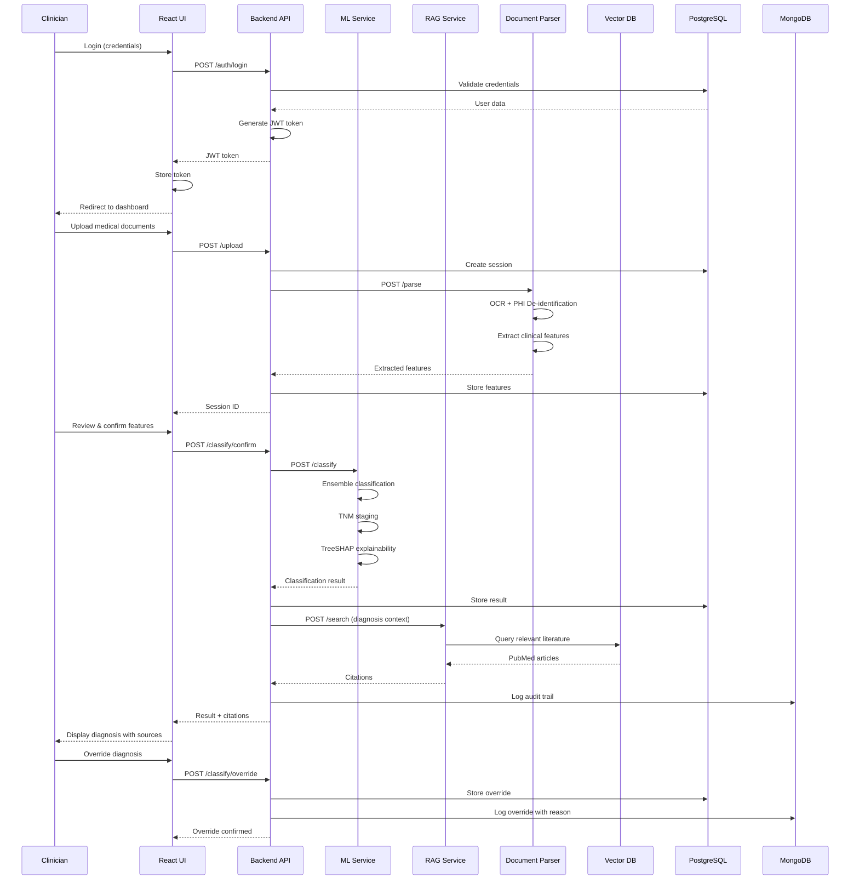
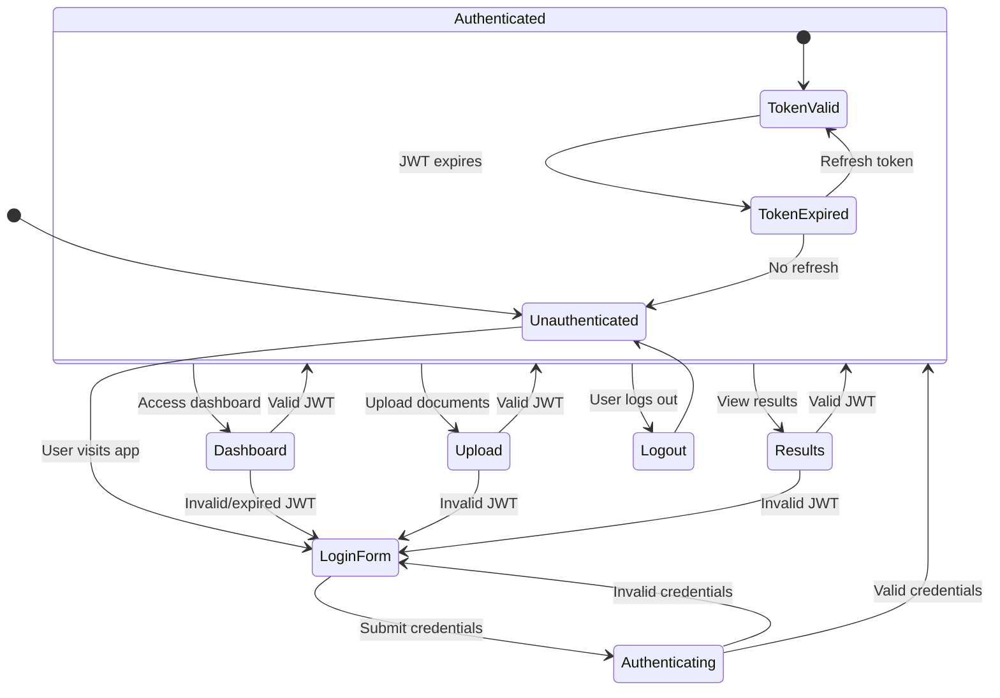
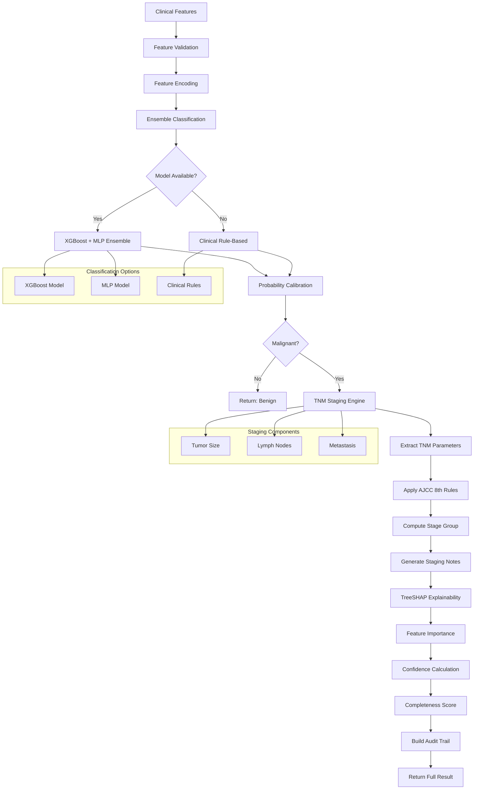
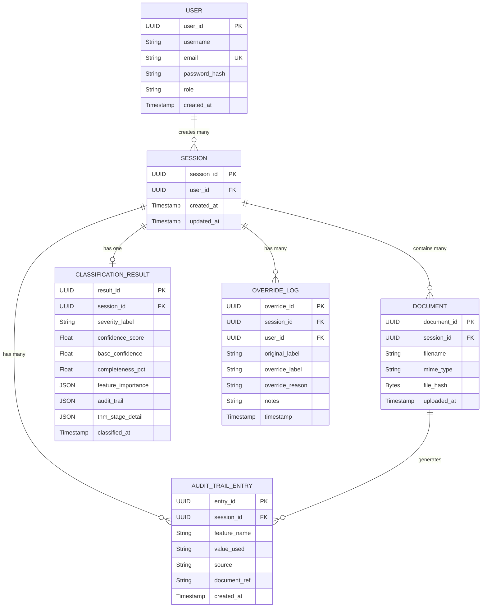
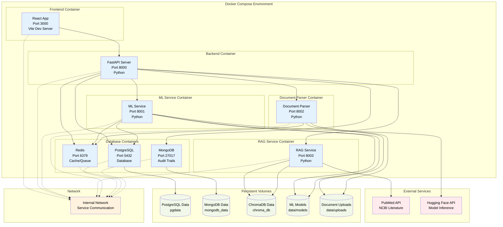

# BreastGuard AI - System Architecture

## 🏗️ System Architecture Overview

```mermaid
graph TB
    subgraph "Frontend Layer"
        UI[React UI<br/>Port 3000<br/>TypeScript + Tailwind]
        UI_AUTH[AuthContext<br/>JWT Management]
        UI_DASHBOARD[Dashboard<br/>Clinical Interface]
        UI_DICOM[DICOM Viewer<br/>Medical Imaging]
        UI_CITATIONS[Citation Panel<br/>PubMed Sources]
    end

    subgraph "Backend Layer"
        BACKEND[FastAPI Backend<br/>Port 8000<br/>Python]
        AUTH_CTRL[Auth Controller<br/>JWT + RBAC]
        CLASSIFY_CTRL[Classification Controller<br/>Session Management]
        UPLOAD_CTRL[Upload Controller<br/>Document Processing]
        ADMIN_CTRL[Admin Controller<br/>User Management]
    end

    subgraph "ML Service Layer"
        ML_SERVICE[ML Service<br/>Port 8001<br/>PyTorch + XGBoost]
        CLASSIFIER[Classifier<br/>Ensemble Model]
        SEVERITY[Severity Engine<br/>TNM Staging]
        EXPLAIN[Explainability<br/>TreeSHAP + Grad-CAM]
        IMAGING[Imaging Model<br/>EfficientNet-B4]
    end

    subgraph "RAG Service Layer"
        RAG_SERVICE[RAG Service<br/>Port 8003<br/>FastAPI]
        PUBMED_CLIENT[PubMed Client<br/>NCBI API]
        VECTOR_DB[ChromaDB<br/>Vector Store]
        EMBEDDING[Embedding Service<br/>BioBERT]
    end

    subgraph "Document Parser Layer"
        PARSER_SERVICE[Document Parser<br/>Port 8002<br/>FastAPI]
        OCR_ENGINE[OCR Engine<br/>Tesseract]
        PHI_DEID[PHI De-identification<br/>Presidio]
        FEATURE_EXTRACT[Feature Extractor<br/>Clinical NLP]
    end

    subgraph "Data Layer"
        POSTGRES[(PostgreSQL<br/>Port 5432<br/>Structured Data)]
        MONGODB[(MongoDB<br/>Port 27017<br/>Audit Trails)]
        REDIS[(Redis<br/>Port 6379<br/>Cache + Queue)]
        CHROMA_VOL[(ChromaDB Volume<br/>Medical Knowledge<br/>Vector Embeddings)]
    end

    subgraph "External Services"
        PUBMED_API[PubMed API<br/>NCBI Literature]
        HF_API[Hugging Face API<br/>Model Inference]
    end

    %% Frontend connections
    UI --> UI_AUTH
    UI --> UI_DASHBOARD
    UI --> UI_DICOM
    UI --> UI_CITATIONS
    UI --> BACKEND

    %% Backend internal connections
    BACKEND --> AUTH_CTRL
    BACKEND --> CLASSIFY_CTRL
    BACKEND --> UPLOAD_CTRL
    BACKEND --> ADMIN_CTRL

    %% Backend to data
    AUTH_CTRL --> POSTGRES
    CLASSIFY_CTRL --> POSTGRES
    UPLOAD_CTRL --> POSTGRES
    CLASSIFY_CTRL --> MONGODB
    BACKEND --> REDIS

    %% Backend to ML
    CLASSIFY_CTRL --> ML_SERVICE

    %% Backend to Parser
    UPLOAD_CTRL --> PARSER_SERVICE

    %% Backend to RAG
    CLASSIFY_CTRL --> RAG_SERVICE

    %% ML Service internal
    ML_SERVICE --> CLASSIFIER
    ML_SERVICE --> SEVERITY
    ML_SERVICE --> EXPLAIN
    ML_SERVICE --> IMAGING

    %% RAG Service internal
    RAG_SERVICE --> PUBMED_CLIENT
    RAG_SERVICE --> VECTOR_DB
    RAG_SERVICE --> EMBEDDING
    VECTOR_DB --> CHROMA_VOL

    %% Parser Service internal
    PARSER_SERVICE --> OCR_ENGINE
    PARSER_SERVICE --> PHI_DEID
    PARSER_SERVICE --> FEATURE_EXTRACT

    %% External connections
    PUBMED_CLIENT --> PUBMED_API
    IMAGING --> HF_API

    classDef frontend fill:#e1f5fe, color:#000
    classDef backend fill:#f3e5f5, color:#000
    classDef ml fill:#e8f5e8, color:#000
    classDef rag fill:#fff3e0, color:#000
    classDef parser fill:#fce4ec, color:#000
    classDef data fill:#e0f2f1, color:#000
    classDef external fill:#ffebee, color:#000

    class UI,UI_AUTH,UI_DASHBOARD,UI_DICOM,UI_CITATIONS frontend
    class BACKEND,AUTH_CTRL,CLASSIFY_CTRL,UPLOAD_CTRL,ADMIN_CTRL backend
    class ML_SERVICE,CLASSIFIER,SEVERITY,EXPLAIN,IMAGING ml
    class RAG_SERVICE,PUBMED_CLIENT,VECTOR_DB,EMBEDDING rag
    class PARSER_SERVICE,OCR_ENGINE,PHI_DEID,FEATURE_EXTRACT parser
    class POSTGRES,MONGODB,REDIS,CHROMA_VOL data
    class PUBMED_API,HF_API external
```



## 🔄 Detailed Data Flow



## 🗂️ File Structure & Dependencies

```mermaid
graph TD
    subgraph "Root Level"
        DOCKER[docker-compose.yml<br/>Service Orchestration]
        ENV[.env<br/>Environment Variables]
        README[README.md<br/>Documentation]
    end

    subgraph "Frontend (/frontend/)"
        UI_PKG[package.json<br/>Dependencies]
        UI_MAIN[App.tsx<br/>Entry Point]
        UI_AUTH[AuthContext.tsx<br/>JWT Management]

        subgraph "UI Pages"
            UI_DASH[Dashboard.tsx<br/>Main Interface]
            UI_UPLOAD[UploadPage.tsx<br/>Document Upload]
            UI_RESULTS[ResultsPage.tsx<br/>Classification Results]
        end

        subgraph "UI Components"
            UI_DICOM[DICOMViewer.tsx<br/>Medical Imaging]
            UI_CITATION[CitationPanel.tsx<br/>PubMed Sources]
            UI_FEATURE[FeatureEditor.tsx<br/>Clinical Features]
        end

        UI_CONFIG[vite.config.ts<br/>Build Config]
    end

    subgraph "Backend (/services/backend/)"
        BE_MAIN[main.py<br/>FastAPI Entry]
        BE_REQ[requirements.txt<br/>Dependencies]

        subgraph "Backend Config"
            BE_DB[config/database.py<br/>PostgreSQL Connection]
            BE_AUTH[config/auth.py<br/>JWT Config]
        end

        subgraph "Backend Models"
            BE_SESSION[models/db_models.py<br/>ORM Models]
            BE_OVERRIDE[models/override.py<br/>Override Log]
        end

        subgraph "Backend Routers"
            BE_AUTH_ROUTE[routers/auth.py<br/>Auth Endpoints]
            BE_CLASS_ROUTE[routers/classify.py<br/>Classification]
            BE_UPLOAD_ROUTE[routers/upload.py<br/>Upload Endpoints]
        end

        subgraph "Backend Services"
            BE_AUDIT[services/mongodb_audit.py<br/>Audit Trail]
            BE_VALID[validation/manual_entry.py<br/>Feature Validation]
        end

        subgraph "Backend Security"
            BE_JWT[security/auth.py<br/>JWT Implementation]
        end

        BE_DOCKER[Dockerfile<br/>Container Config]
    end

    subgraph "ML Service (/services/ml_service/)"
        ML_MAIN[main.py<br/>FastAPI Entry]
        ML_REQ[requirements.txt<br/>Dependencies]

        subgraph "ML Models"
            ML_CLASS[classifier.py<br/>Ensemble Classifier]
            ML_SEVER[severity_engine.py<br/>Severity Pipeline]
            ML_TNM[tnm_rule_engine.py<br/>AJCC Staging]
            ML_IMAGING[imaging_model.py<br/>EfficientNet-B4]
        end

        subgraph "ML Explainability"
            ML_SHAP[explainability.py<br/>TreeSHAP]
        end

        ML_DOCKER[Dockerfile<br/>Container Config]
    end

    subgraph "RAG Service (/services/rag_service/)"
        RAG_MAIN[main.py<br/>FastAPI Entry]
        RAG_REQ[requirements.txt<br/>Dependencies]
        RAG_CONFIG[config.py<br/>Configuration]

        subgraph "RAG Components"
            RAG_PUBMED[pubmed_client.py<br/>NCBI API]
            RAG_EMBED[embedding_service.py<br/>BioBERT]
            RAG_VECTOR[vector_store.py<br/>ChromaDB]
        end

        RAG_DOCKER[Dockerfile<br/>Container Config]
    end

    subgraph "Document Parser (/services/document_parser/)"
        DP_MAIN[main.py<br/>FastAPI Entry]
        DP_REQ[requirements.txt<br/>Dependencies]

        subgraph "Parser Components"
            DP_PARSER[parser.py<br/>Document Parsing]
            DP_FEATURE[feature_extractor.py<br/>Feature Extraction]
            DP_PHI[phi_deidentification.py<br/>HIPAA Compliance]
        end

        DP_DOCKER[Dockerfile<br/>Container Config]
    end

    subgraph "Data (/data/)"
        DATA_DB[database/<br/>PostgreSQL Data]
        DATA_CHROMA[chroma_db/<br/>Vector Database]
        DATA_MODELS[models/<br/>ML Weights]
        DATA_UPLOADS[uploads/<br/>Document Storage]
    end

    %% Dependencies
    DOCKER --> UI_PKG
    DOCKER --> BE_REQ
    DOCKER --> ML_REQ
    DOCKER --> RAG_REQ
    DOCKER --> DP_REQ

    UI_MAIN --> UI_AUTH
    UI_MAIN --> UI_DASH
    UI_DASH --> UI_UPLOAD
    UI_DASH --> UI_RESULTS
    UI_RESULTS --> UI_DICOM
    UI_RESULTS --> UI_CITATION
    UI_UPLOAD --> UI_FEATURE

    BE_MAIN --> BE_DB
    BE_MAIN --> BE_AUTH_ROUTE
    BE_MAIN --> BE_CLASS_ROUTE
    BE_MAIN --> BE_UPLOAD_ROUTE
    BE_AUTH_ROUTE --> BE_JWT
    BE_CLASS_ROUTE --> BE_AUDIT
    BE_UPLOAD_ROUTE --> BE_VALID
    BE_AUTH_ROUTE --> BE_SESSION
    BE_CLASS_ROUTE --> BE_OVERRIDE

    ML_MAIN --> ML_CLASS
    ML_MAIN --> ML_SEVER
    ML_MAIN --> ML_TNM
    ML_MAIN --> ML_IMAGING
    ML_SEVER --> ML_SHAP

    RAG_MAIN --> RAG_PUBMED
    RAG_MAIN --> RAG_EMBED
    RAG_MAIN --> RAG_VECTOR
    RAG_PUBMED --> RAG_VECTOR
    RAG_EMBED --> RAG_VECTOR

    DP_MAIN --> DP_PARSER
    DP_MAIN --> DP_FEATURE
    DP_MAIN --> DP_PHI

    classDef root fill:#ffecb3, color:#000
    classDef frontend fill:#e1f5fe, color:#000
    classDef backend fill:#f3e5f5, color:#000
    classDef ml fill:#e8f5e8, color:#000
    classDef rag fill:#fff3e0, color:#000
    classDef parser fill:#fce4ec, color:#000
    classDef data fill:#e0f2f1, color:#000

    class DOCKER,ENV,README root
    class UI_PKG,UI_MAIN,UI_AUTH,UI_DASH,UI_UPLOAD,UI_RESULTS,UI_DICOM,UI_CITATION,UI_FEATURE,UI_CONFIG frontend
    class BE_MAIN,BE_REQ,BE_DB,BE_AUTH,BE_SESSION,BE_OVERRIDE,BE_AUTH_ROUTE,BE_CLASS_ROUTE,BE_UPLOAD_ROUTE,BE_AUDIT,BE_VALID,BE_JWT,BE_DOCKER backend
    class ML_MAIN,ML_REQ,ML_CLASS,ML_SEVER,ML_TNM,ML_IMAGING,ML_SHAP,ML_DOCKER ml
    class RAG_MAIN,RAG_REQ,RAG_CONFIG,RAG_PUBMED,RAG_EMBED,RAG_VECTOR,RAG_DOCKER rag
    class DP_MAIN,DP_REQ,DP_PARSER,DP_FEATURE,DP_PHI,DP_DOCKER parser
    class DATA_DB,DATA_CHROMA,DATA_MODELS,DATA_UPLOADS data
```



## 🔐 Authentication & Authorization Flow



## 🤖 ML Pipeline Detailed Flow



## 💾 Database Schema Relationships



## 🚀 Deployment Architecture



## 🔄 API Endpoints & Request/Response Flow

```mermaid
graph LR
    subgraph "Frontend (React)"
        UI_AUTH[Auth Pages]
        UI_DASH[Dashboard]
        UI_UPLOAD[Upload]
        UI_RESULTS[Results]
    end

    subgraph "Backend API (FastAPI)"
        subgraph "Auth Routes (/auth)"
            AUTH_LOGIN[POST /login]
            AUTH_REGISTER[POST /register]
        end

        subgraph "Classification Routes (/classify)"
            CLASS_CREATE[POST /classify]
            CLASS_REVIEW[GET /classify/{id}/review]
            CLASS_CONFIRM[POST /classify/{id}/confirm]
            CLASS_OVERRIDE[POST /classify/{id}/override]
            CLASS_AUDIT[GET /classify/{id}/audit]
        end

        subgraph "Upload Routes (/upload)"
            UPLOAD_DOC[POST /upload]
        end

        subgraph "Admin Routes (/admin)"
            ADMIN_STATS[GET /statistics]
            ADMIN_OVERRIDE[GET /overrides/statistics]
        end
    end

    subgraph "ML Service (FastAPI)"
        ML_CLASSIFY[POST /classify]
    end

    subgraph "RAG Service (FastAPI)"
        RAG_SEARCH[POST /search]
        RAG_INGEST[POST /ingest]
    end

    subgraph "Document Parser (FastAPI)"
        PARSE_PARSE[POST /parse]
    end

    subgraph "External APIs"
        PUBMED[PubMed API]
    end

    %% Frontend to Backend
    UI_AUTH --> AUTH_LOGIN
    UI_AUTH --> AUTH_REGISTER
    UI_DASH --> CLASS_CREATE
    UI_UPLOAD --> UPLOAD_DOC
    UI_RESULTS --> CLASS_REVIEW
    UI_RESULTS --> CLASS_CONFIRM
    UI_RESULTS --> CLASS_OVERRIDE
    UI_RESULTS --> CLASS_AUDIT
    UI_DASH --> ADMIN_STATS
    UI_DASH --> ADMIN_OVERRIDE

    %% Backend to ML
    CLASS_CONFIRM --> ML_CLASSIFY

    %% Backend to RAG
    CLASS_CONFIRM --> RAG_SEARCH

    %% Backend to Parser
    UPLOAD_DOC --> PARSE_PARSE

    %% RAG to External
    RAG_INGEST --> PUBMED

    classDef frontend fill:#e1f5fe, color:#000
    classDef backend fill:#f3e5f5, color:#000
    classDef ml fill:#e8f5e8, color:#000
    classDef rag fill:#fff3e0, color:#000
    classDef parser fill:#fce4ec, color:#000
    classDef external fill:#ffebee, color:#000

    class UI_AUTH,UI_DASH,UI_UPLOAD,UI_RESULTS frontend
    class AUTH_LOGIN,AUTH_REGISTER,CLASS_CREATE,CLASS_REVIEW,CLASS_CONFIRM,CLASS_OVERRIDE,CLASS_AUDIT,UPLOAD_DOC,ADMIN_STATS,ADMIN_OVERRIDE backend
    class ML_CLASSIFY ml
    class RAG_SEARCH,RAG_INGEST rag
    class PARSE_PARSE parser
    class PUBMED external
```

## 📊 Component State Management

```mermaid
graph TD
    subgraph "React Context Providers"
        AUTH_PROVIDER[AuthProvider<br/>JWT Token Management]
        SESSION_PROVIDER[SessionProvider<br/>Classification State]
    end

    subgraph "Auth State"
        AUTH_TOKEN[JWT Token<br/>localStorage]
        AUTH_USER[User Object<br/>Decoded from JWT]
        AUTH_LOADING[Loading State]
    end

    subgraph "Session State"
        SESSION_ID[Session ID<br/>Current Classification]
        SESSION_FEATURES[Clinical Features<br/>Extracted Data]
        SESSION_RESULT[Classification Result<br/>AI Output]
        SESSION_CITATIONS[Citations<br/>PubMed Sources]
        SESSION_LOADING[Loading State]
    end

    subgraph "UI Components"
        NAVBAR[Navbar<br/>Auth Status]
        DASHBOARD[Dashboard<br/>Main Interface]
        UPLOAD[UploadPage<br/>Document Upload]
        RESULTS[ResultsPage<br/>Classification Display]
        FEATURE_EDIT[FeatureEditor<br/>Clinical Features]
        DICOM_VIEW[DICOMViewer<br/>Medical Imaging]
        CITATION_PANEL[CitationPanel<br/>Sources Display]
    end

    %% Context to State
    AUTH_PROVIDER --> AUTH_TOKEN
    AUTH_PROVIDER --> AUTH_USER
    AUTH_PROVIDER --> AUTH_LOADING

    SESSION_PROVIDER --> SESSION_ID
    SESSION_PROVIDER --> SESSION_FEATURES
    SESSION_PROVIDER --> SESSION_RESULT
    SESSION_PROVIDER --> SESSION_CITATIONS
    SESSION_PROVIDER --> SESSION_LOADING

    %% State to Components
    AUTH_TOKEN --> NAVBAR
    AUTH_USER --> NAVBAR
    AUTH_LOADING --> NAVBAR

    SESSION_ID --> DASHBOARD
    SESSION_FEATURES --> RESULTS
    SESSION_RESULT --> RESULTS
    SESSION_CITATIONS --> RESULTS
    SESSION_LOADING --> DASHBOARD

    SESSION_FEATURES --> FEATURE_EDIT
    SESSION_RESULT --> DICOM_VIEW
    SESSION_CITATIONS --> CITATION_PANEL

    classDef context fill:#e8f5e8, color:#000
    classDef state fill:#fff3e0, color:#000
    classDef component fill:#e1f5fe, color:#000

    class AUTH_PROVIDER,SESSION_PROVIDER context
    class AUTH_TOKEN,AUTH_USER,AUTH_LOADING,SESSION_ID,SESSION_FEATURES,SESSION_RESULT,SESSION_CITATIONS,SESSION_LOADING state
    class NAVBAR,DASHBOARD,UPLOAD,RESULTS,FEATURE_EDIT,DICOM_VIEW,CITATION_PANEL component
```


